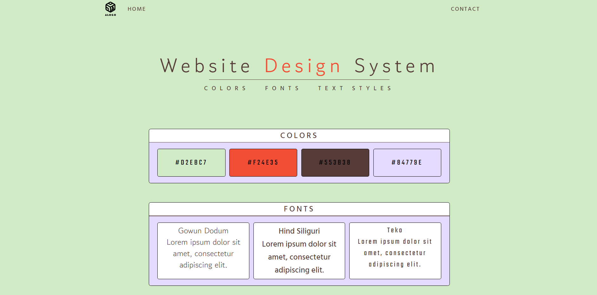

# Website Design System
Sample website containing a template to its own color scheme, text, and font styles. Created as part of  the Full Stack Engineering Course at Codecademy. The site will continue to be updated as I progress through the course and create new site themes. 

## Table of Contents
* [Technologies Used](#technologies-used)
* [Screenshots](#screenshots)
* [Features](#features)
* [Setup](#setup)
* [Future Updates](#future-updates)

## Technologies Used
HTML5   CSS3   Git   GitHub
   

## Screenshots

## Features
- Fixed position header
- Link hover effects
- Responsive design

## Setup
- Live version is available at https://russelbrouts.github.io/WebsiteDesignSystem/
- Available on [GitHub](https://github.com/RusselBrouts/WebsiteDesignSystem)

## Future Updates
- Add images, improve styling of main page
- Create separate pages for each style type
- Add more styles, more pages
- Connect header links, add header menu buttons
- Add footer with contact information